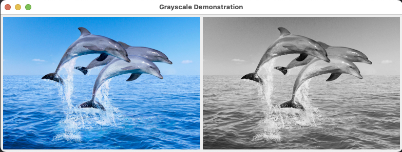

# Java Image Processor
by Logan Zehr

---

## Introduction
Java Image Processor is a passion project I started to better my Java 
knowledge and dive into the world of image processing. This is very 
early on in the project, but feel free to mess around with it. I'll 
put the installation and usage instructions below.

The decision to use Java 1.8 is purely because that is what I'm using in
school right now.

---

## Installation

### Requirements:
- Java 1.8 Compiler

### Instructions:
1. Clone the repo locally using `git clone git@github.com:zehrl/image-processing.git`
2. Ensure your compiler is setup for Java 1.8
3. Navigate to the project directory and compile the file `javac Main.java`
4. Run the compiled code `java Main`

---

## Using different images

Inside of `Main.java`, feel free to update the `String pathName = "images/dolphins_jumping.jpg";` line
to whatever file path you'd like.

---

## Contact

Feel free to reach out to me at zehr@usc.edu
